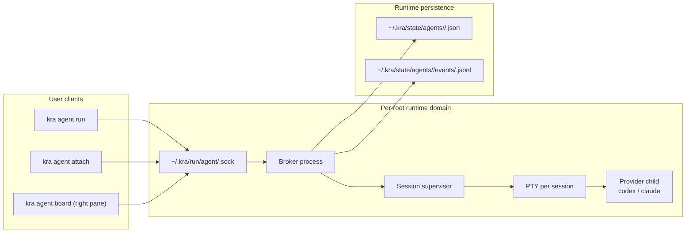

# Agent Runtime Control Plane Design

## Objective

Deliver a high-value agent experience where operators can:

- launch sessions detached from terminal tabs
- attach/reattach from manager UI or CLI
- observe the same live terminal stream from multiple clients
- send input safely via writer lease + immediate takeover

This design targets single-host, single-`KRA_ROOT` scope for MVP.

## Non-goals

- cross-host attach/control
- distributed/high-availability broker
- provider-internal conversation parsing/indexing

## System Overview

## Lifecycle Summary

### 1. Run (detached default)

1. `kra agent run` resolves `KRA_ROOT` and `root-hash`.
2. Client connects to per-root socket.
3. If missing/stale, client spawns broker and reconnects.
4. Client sends `CreateSession` request (`workspace/repo/kind/launch_mode`).
5. Broker allocates PTY and spawns provider child process.
6. Broker writes snapshot + events.
7. If `--attach`, caller attaches immediately; otherwise command exits.

### 2. Attach / Reattach

1. `kra agent attach` resolves current scope from `cwd`.
2. If `--session` omitted, client queries candidates in scope.
3. Client attaches to selected session stream.
4. Client may request lease for input.

### 3. Stop

1. Stop request resolves target session.
2. Broker sends graceful signal and waits grace period.
3. If needed, force kill.
4. Broker persists final `exited` snapshot and `process_exited` event.

## Attach Scope Policy

- repo context (`workspaces/<id>/repos/<repo-key>/...`):
  - allow sessions for same workspace+repo only
- workspace context (`workspaces/<id>/...`):
  - allow sessions for same workspace only
- `KRA_ROOT` root:
  - strict error (`attach context too broad`)
- outside `KRA_ROOT`:
  - strict error

Rationale: keep `attach` focused on "return to current work", and reserve
global discovery for `board`.

## Launch Mode Abstraction

`kra` exposes provider-neutral launch mode:

- `--launch default|resume|continue`

Mapping:

- codex:
  - default -> `codex`
  - resume -> `codex resume`
  - continue -> unsupported (fail fast)
- claude:
  - default -> `claude`
  - resume -> `claude --resume`
  - continue -> `claude --continue`

Default launch mode is always `default`.

## State Model

Split state into current snapshot and append-only events.

### Snapshot (`<session-id>.json`)

Required fields:

- session identity: `session_id`, `root_path`, `workspace_id`, `execution_scope`, `repo_key`, `kind`
- process: `pid`, `runtime_state`, `exit_code`
- timing/version: `started_at`, `updated_at`, `seq`
- launch/input: `launch_mode`, `attached_clients`, `writer_owner`, `lease_expires_at`

### Events (`events/<session-id>.jsonl`)

Primary event types:

- session/process: `session_created`, `process_started`, `process_exited`
- attachment: `client_attached`, `client_detached`
- lease: `lease_acquired`, `lease_heartbeat`, `lease_released`, `lease_takeover`
- safety: `danger_key_confirmed`

## Input Safety Model

- multi-attach is allowed (multiple readers)
- single writer is enforced by lease ownership
- takeover is immediate when confirmed
- dangerous control keys (`Ctrl-C`, `Ctrl-D`, `Ctrl-Z`) require confirmation
- lease liveness:
  - heartbeat interval: 2s
  - lease TTL: 8s
- explicit release is allowed and immediate

Important distinction:

- lease heartbeat means owner client is alive
- typing activity is separate UX signal (`last_input_at` style), not lease validity

## Failure Handling

- stale socket file:
  - detect with failed handshake
  - recreate socket by broker respawn
- broker crash:
  - next command respawns broker
  - unresolved running sessions are marked `unknown` if ownership cannot be recovered
- malformed state files:
  - parse-isolate per file and continue rendering healthy sessions
- duplicate active target+kind:
  - warn on run, but allow new session

## Implementation Phases

### Phase A (AGENT-050): Broker foundation

- per-root socket path and broker spawn/reconnect
- session create/start lifecycle on broker side
- detached default run + optional immediate attach

Acceptance:

- closing run terminal does not kill detached session
- list/board shows running session with no attached client

### Phase B (AGENT-060): Attach command

- `kra agent attach` command
- scope resolver from current `cwd`
- interactive selector when `--session` omitted

Acceptance:

- repo/workspace scope filters correctly
- root/outside contexts fail with strict errors

### Phase C (AGENT-100): Lease + launch abstraction + events

- lease acquire/heartbeat/release/takeover protocol
- dangerous key confirmations
- `--launch` mapping and unsupported mode validation
- append-only event writing and snapshot extensions

Acceptance:

- only lease owner can send input
- takeover events are recorded and visible in event file
- provider launch commands match mapping table

## Test Strategy

- unit:
  - scope resolver
  - launch mode mapper
  - lease state transitions
  - duplicate run warning logic
- integration:
  - run detached -> attach -> send input -> takeover -> stop
  - broker restart/reconnect behavior
- UI regression:
  - list/board human output includes input ownership fields cleanly
  - attach error messages are stable and actionable
