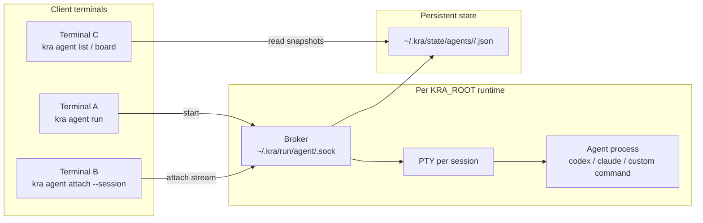
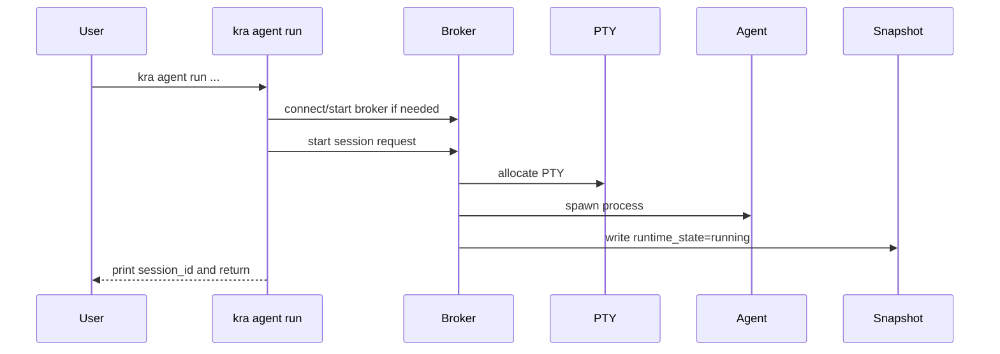

# Agent Runtime Architecture

## Goal

Define a runtime architecture for `kra agent` that:

- keeps agent sessions alive independently of terminal tabs
- supports attach/reattach from another terminal
- keeps runtime files outside `KRA_ROOT` Git working tree

## Decision Snapshot (implemented)

- broker model: per-`KRA_ROOT` local broker over Unix socket
- launch model: detached by default
- connection model: multi-attach view is supported
- attach scope: workspace/repo context only (root/outside is error)
- state model: snapshot JSON per session under `KRA_HOME`

## Beginner-Friendly Terms

- session: one running agent process instance
- attach: connect terminal I/O to existing session PTY
- detach: disconnect terminal while session keeps running
- broker: local manager process that owns PTYs and child processes
- PTY: pseudo terminal used to run CLI agents as interactive programs

## Component Topology



## Concept Map (ASCII)

```text
KRA_ROOT
└─ root-hash
   ├─ broker socket
   │  └─ ~/.kra/run/agent/<root-hash>.sock
   └─ runtime state
      └─ ~/.kra/state/agents/<root-hash>/
         └─ <session-id>.json

Broker (per root)
├─ session s-...-1234
│  ├─ PTY
│  ├─ child process (agent CLI)
│  └─ attached clients (0..N)
└─ session s-...-5678
```

## Directory and Socket Layout

- socket path:
  - `~/.kra/run/agent/<root-hash>.sock`
- snapshot path:
  - `~/.kra/state/agents/<root-hash>/<session-id>.json`

Notes:

- same `KRA_ROOT` always maps to same socket path
- different roots are isolated by different `root-hash`

## Broker Lifecycle

- one broker per `KRA_ROOT`
- `run/stop/attach` connect to socket
- when socket is missing/stale, `run` starts broker and reconnects
- broker auto-exits only when:
  - `session_count=0`
  - no broker requests for 60 seconds
- while sessions exist, broker stays alive

## Lifecycle: run (detached default)



## Lifecycle: attach / reattach

```mermaid
sequenceDiagram
  participant U as User
  participant CLI as kra agent attach
  participant B as Broker
  participant PTY as Session PTY

  U->>CLI: kra agent attach --session <id>
  CLI->>B: attach request
  B-->>CLI: attach accepted
  CLI<->>B: stdin/stdout stream
  B<->>PTY: input/output relay
```

## Attach Scope Resolution

- inside `workspaces/<id>/repos/<repo-key>/...`:
  - candidates are same `workspace + repo`
- inside `workspaces/<id>/...`:
  - candidates are same workspace
- at `KRA_ROOT` root:
  - error (scope too broad)
- outside `KRA_ROOT`:
  - error

## Runtime State

Current process state axis:

- `running`
- `idle`
- `exited`
- `unknown`

Snapshot updates are atomic and increment session `seq`.

## Deferred (AGENT-100)

- writer lease / takeover protocol
- dangerous key confirmation
- append-only event log (`events/<session-id>.jsonl`)
- launch abstraction (`--launch default|resume|continue`)
- attach/input ownership fields in snapshot
